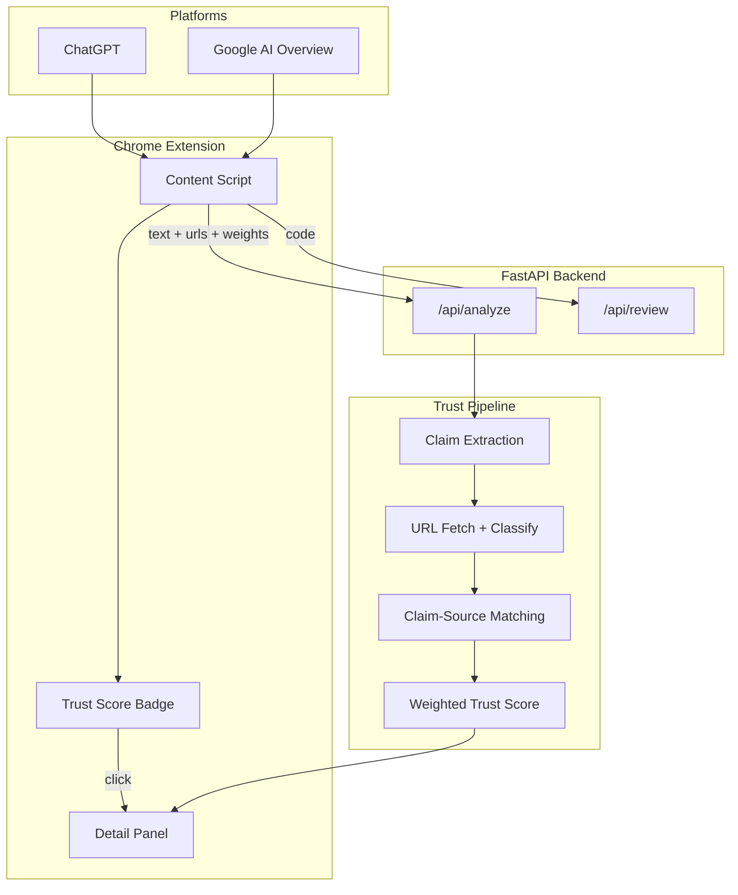

# CheckEverything — AI Response Trust & Credibility Checker

**A Chrome extension that automatically analyzes AI-generated answers and gives users a transparent trust score with claim-level evidence — powered by Google ADK + Gemini**

checkeverything is a Chrome extension and backend system that helps users evaluate how trustworthy AI-generated responses are. Instead of giving only a vague score, checkeverything breaks down AI answers into clear categories such as **claim support, source quality, citation accuracy, freshness, and missing context**.

The first version started as an AI code review assistant, but the product is expanding into a broader AI response credibility checker.

## Problem

AI answers often sound confident, but users cannot easily tell whether claims are supported by real sources, citations actually prove what the AI says, information is outdated, or important context is missing.

## Solution

CheckEverything overlays a trust badge on AI responses and breaks down the score into source quality, claim support, citation accuracy, freshness, and missing context. The goal is not to simply say "true" or "false," but to help users understand which parts of an AI response are **strongly supported, weakly supported, unclear, or potentially outdated**.

Example:

```text
Trust Score: 78%
```

When users click the badge, they can see a detailed breakdown:

| Category | Purpose |
| --- | --- |
| **Claim Support** | Checks whether the main claims are supported by evidence |
| **Source Quality** | Evaluates whether cited sources are reliable |
| **Citation Accuracy** | Checks whether citations actually prove the claims |
| **Freshness** | Flags information that may be outdated |
| **Bias / Missing Context** | Identifies one-sided or incomplete explanations |

## Current Status

**Trust checker (live):** Chrome extension on ChatGPT + Google AI Overview with trust badge, source checks, claim-to-source matching, and configurable score weights.

**Code review (also live):** 5-agent multi-agent review for code snippets and PR diffs via web UI and ChatGPT code responses.

## Demo

CheckEverything overlays a **Trust Score** badge on AI answers. Click the badge to see claim-level evidence.

| Feature | What you see |
| --- | --- |
| ChatGPT trust badge | Trust Score on assistant responses |
| Google AI Overview badge | Trust Score on AI Overview blocks |
| Claim-level matching | ✓ Supported / ~ Weakly supported / ! Not clearly supported |
| Source checks | Reachability, domain type, and cited source list |

### Screenshots

Add captures to `docs/demo/` and they will appear here:

| Screenshot | File |
| --- | --- |
| ChatGPT trust badge | `docs/demo/chatgpt-trust-badge.png` |
| Google AI Overview badge | `docs/demo/google-ai-overview-badge.png` |
| Claim evidence panel | `docs/demo/claim-evidence-panel.png` |
| Source quality breakdown | `docs/demo/source-breakdown.png` |

Optional: add a short GIF at `docs/demo/trust-score-demo.gif`.

```bash
./scripts/run.sh
# Load extension → click Trust Score on ChatGPT or Google AI Overview
```

## Architecture



## Limitations

- **Preliminary analysis, not fact-checking** — scores are credibility signals based on claim structure, source metadata, and excerpt matching.
- **Source extraction** — some sites block requests, require JavaScript, or return incomplete page text.
- **Google AI Overview DOM** — layout changes frequently; detection uses fallback heuristics and may miss some overviews.
- **Claim matching** — compares against fetched excerpts (up to ~8k chars), not full document verification.
- **English-first** — optimized for English AI responses; other languages may vary in quality.

## Current Implementation: 5-Agent Code Review

The current version uses a multi-agent review system to analyze code. Five specialist agents review the submission in parallel, and a coordinator agent synthesizes the final result.

| Agent | Focus |
| --- | --- |
| **Security** | Injection, secrets, unsafe patterns |
| **Correctness** | Bugs, logic errors, edge cases |
| **Readability** | Naming, structure, documentation |
| **Performance** | Inefficiencies, anti-patterns |
| **Test Coverage** | Missing tests, testability |
| **Coordinator** | Synthesizes verdict, score, and action items |

## Google Technology

| Tech | Usage |
| --- | --- |
| **Google ADK** | `ParallelAgent` for specialist agents, followed by `SequentialAgent` and coordinator |
| **Gemini API** | Structured JSON output per agent |
| **Vertex AI** | Optional enterprise deployment path |
| **Cloud Run** | Deployable backend using `./scripts/deploy-cloudrun.sh` |
| **Chrome Extension APIs** | Browser-based overlay for AI response analysis |

## Quick Start

```bash
./scripts/setup.sh
cp .env.example .env   # add GEMINI_API_KEY
./scripts/run.sh
```

Open the printed URL, then select:

```text
Load sample → Run 5-Agent Review
```

### PR Diff Review

Switch to the **PR Diff** tab, then paste `git diff` output or upload a `.diff` file. The system reviews only the changed lines.

### Chrome Extension

```bash
./scripts/run.sh
# Chrome → chrome://extensions → Load unpacked → extension/
```

The extension detects ChatGPT assistant responses and **Google AI Overview** blocks on search pages. Click **Trust Score** to analyze — claim evidence, source checks, and adjustable weights in extension options.

See `extension/README.md`.

### ADK Interactive UI

```bash
adk web adk_agents
```

### Evaluation Harness

```bash
./scripts/eval.sh          # offline demo mode
./scripts/eval.sh --live   # live Gemini API
```

### Deploy to Cloud Run

```bash
GCP_PROJECT_ID=your-project ./scripts/deploy-cloudrun.sh
```

## API

### Current Code Review API

**POST** `/api/review` — full review  
**POST** `/api/review/stream` — SSE progress per agent  
**POST** `/api/parse-diff` — preview diff extraction

```json
{
  "submission_type": "diff",
  "diff": "diff --git a/foo.py...",
  "context": "PR #42"
}
```

### Planned Trust Analysis API

**POST** `/api/analyze` — preliminary trust and credibility analysis for AI responses

Optional `weights` object (percentages, normalized server-side if they do not sum to 100):

```json
{
  "text": "AI response text...",
  "urls": ["https://example.com/article"],
  "source": "google_ai_overview",
  "weights": {
    "claim_support": 35,
    "source_quality": 25,
    "citation_accuracy": 25,
    "bias_context": 10,
    "freshness": 5
  }
}
```

Returns claim-level breakdown with category scores. This is a **credibility signal**, not full factual verification.

Example response shape:

```json
{
  "overall_score": 78,
  "categories": {
    "claim_support": {
      "score": 70,
      "summary": "Most claims are supported, but one claim needs stronger evidence."
    },
    "source_quality": {
      "score": 85,
      "summary": "Sources appear mostly reliable."
    },
    "citation_accuracy": {
      "score": 65,
      "summary": "Some citations do not clearly prove the related claims."
    },
    "freshness": {
      "score": 90,
      "summary": "Information appears recent enough for the topic."
    },
    "bias_context": {
      "score": 75,
      "summary": "The answer is mostly balanced but could include more context."
    }
  },
  "claims": [
    {
      "text": "Example factual claim from the AI response.",
      "status": "weakly_supported",
      "matched_source": "https://example.com/article",
      "support_label": "weakly_supported",
      "evidence_note": "The source discusses the topic but does not clearly prove the full claim."
    }
  ],
  "sources": [
    {
      "url": "https://example.com/article",
      "domain": "example.com",
      "reachable": true,
      "title": "Article title",
      "source_quality": "medium",
      "notes": "Reachable source, but authority level is unclear."
    }
  ],
  "source_summary": {
    "sources_checked": 1,
    "reachable_count": 1,
    "primary_official_count": 0,
    "issues": []
  }
}
```

## Product Roadmap

### Phase 1 — Current Build

- 5-agent code review system
- FastAPI backend
- Chrome extension for ChatGPT code review responses
- Streaming review UI
- PR diff review support
- Google ADK + Gemini integration

### Phase 2 — Trust Score MVP

- Detect ChatGPT responses automatically
- Extract factual claims and citations (`/api/analyze`)
- Fetch and classify cited URLs with reachability checks
- Match claims to source excerpts with support labels
- Google AI Overview support on `google.com/search`
- Show trust badge and detailed panel for both modes

### Phase 3 — Expanded Platform Support

- Gemini, Claude, Perplexity support
- History dashboard
- Researcher / student / professional modes
- README demo GIF and screenshot gallery

## Project Structure

```text
├── adk_agents/checkeverything/   # Google ADK 5-agent graph
├── backend/                      # API, orchestrator, evaluation
├── extension/                    # Chrome extension
├── eval/                         # Labeled samples for recall metrics
├── frontend/                     # Streaming web UI + diff upload
├── examples/                     # vulnerable_auth.py, sample_pr.diff
├── Dockerfile                    # Cloud Run container
├── cloudbuild.yaml
└── scripts/                      # setup, run, test, eval, deploy
```

## About

Solo project by **Jiwon Min** at **York University**.

checkeverything started as a multi-agent code review tool using Google ADK and Gemini. It is evolving into a broader AI credibility checker that helps users understand whether AI-generated responses are supported, reliable, and properly cited.

## License

MIT
