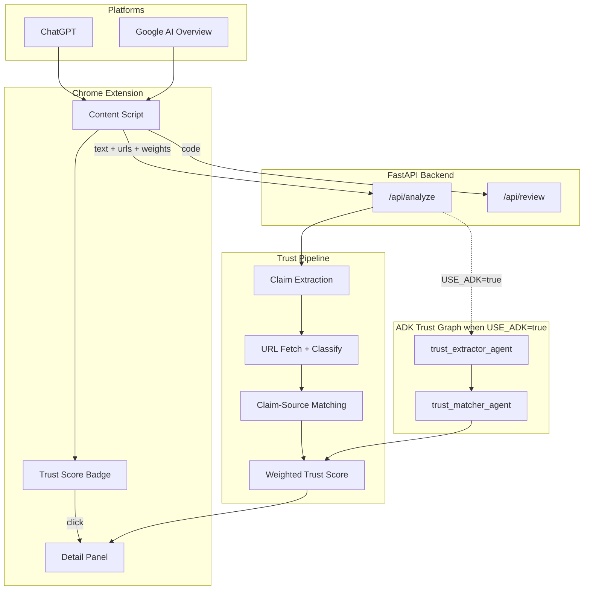

# CheckEverything

**CheckEverything is a Chrome extension that overlays a Trust Score on AI-generated answers and shows which claims are supported, weakly supported, unsupported, or linked to unavailable sources.**

A browser extension that checks AI-generated answers by **extracting claims, checking cited sources, matching claims to source text, and showing a transparent Trust Score** — powered by Google Gemini.

Also includes a multi-agent **code review** mode for ChatGPT code responses and a web UI for PR diffs.

> **Competition submission (GDG YorkU / Google Toronto):** Paste this README link in the form, or jump to [**Competition Submission**](#competition-submission) below.  
> Also see: [`docs/SUBMISSION.md`](docs/SUBMISSION.md) (one-page) · [`docs/GOOGLE_CLOUD.md`](docs/GOOGLE_CLOUD.md) (Cloud Run deploy) · [`docs/demo/DEMO_SCRIPT.md`](docs/demo/DEMO_SCRIPT.md) (15–25s video)

| Form field | Where to point judges |
| --- | --- |
| **Written summary link** | This README → [#competition-submission](#competition-submission) |
| **Google technology** | Gemini API + ADK + Cloud Run (+ optional Vertex AI) — details below |
| **Demo video** | Mock pages at `/demo` — script in `docs/demo/DEMO_SCRIPT.md` |
| **Live backend** | Cloud Run HTTPS URL → Extension options → **Cloud Run** preset |

## Demo

<p align="center">
  
  
</p>

<p align="center">
  
  
</p>

> **Note:** Demo screenshots live in `docs/demo/`. To recapture them, follow [`docs/demo/DEMO_SCRIPT.md`](docs/demo/DEMO_SCRIPT.md) and run `./scripts/check-demo-assets.sh` to verify.

| In 10 seconds | What CheckEverything shows |
| --- | --- |
| Trust Score badge | Overlays on ChatGPT + Google AI Overview |
| Source checks | Reachable? Official domain? |
| Claim evidence | ✓ Supported · ~ Weakly supported · High/Medium/Low confidence |
| Your priorities | Adjustable category weights in extension options |

Optional demo GIF: `docs/demo/trust-score-demo.gif`

```bash
./scripts/demo-screenshots.sh   # recommended for judges — local mock pages, offline
./scripts/check-demo-assets.sh  # verify screenshots exist
```

**Video demo (reliable path):** `./scripts/demo-screenshots.sh` → open `http://localhost:8080/demo` → reload extension → click **Trust Score** on mock ChatGPT. Avoid live ChatGPT/Google for judging — DOM and regional AI Overview vary. Full script: [`docs/demo/DEMO_SCRIPT.md`](docs/demo/DEMO_SCRIPT.md).

## Competition Submission

*Copy this section for judges, or link directly: [`README#competition-submission`](https://github.com/jiwonminn/checkeverything#competition-submission)*

### Problem we targeted

AI assistants (ChatGPT, Google AI Overview) answer with confident prose and citations, but users cannot easily tell:

- which factual claims are actually supported by cited sources  
- whether a citation is reachable, authoritative, or relevant  
- when an answer overstates what the evidence supports  

**Who this helps:** students verifying AI study answers, developers sanity-checking AI Overview summaries, and anyone who needs to see *which claims are backed* before trusting an answer.

CheckEverything adds a **Trust Score badge** on AI responses plus **claim-level evidence** (Supported · Weakly supported · Not supported · Source unavailable) — a transparency layer, not a black-box verdict.

### Architecture decisions

| Decision | Why |
| --- | --- |
| **Chrome extension overlay** | Meets users where AI answers already appear; click-to-analyze only (no background scraping) |
| **FastAPI backend on Cloud Run** | One HTTPS endpoint for extension, web UI, and mock demo pages |
| **Source fetch before LLM** | Server fetches cited URLs (title, excerpt, domain tier) so Gemini reasons over real page text |
| **Two-stage trust pipeline** | (1) Extract claims + category scores → (2) Match claims to source excerpts → weighted Trust Score |
| **Google ADK `SequentialAgent`** | `trust_extractor_agent` → `trust_matcher_agent` when `USE_ADK=true` (production default on Cloud Run) |
| **Heuristic score blending** | Combines Gemini judgment with reachability, domain authority, and support-label signals |
| **Demo fallbacks** | `DEMO_MODE` + offline mock pages (`/demo/chatgpt`, `/demo/google-overview`) for reliable judging without live AI sites |
| **5-agent code review (secondary)** | ADK `ParallelAgent` + coordinator for ChatGPT code blocks and PR diffs via web UI |

See the [architecture diagram](#architecture) below.

### Google technology used (and why)

| Technology | Role in CheckEverything | Why we chose it |
| --- | --- | --- |
| **Gemini API** | Structured JSON for trust analysis, claim matching, and all code-review agents | `response_schema` gives reliable scores and claim lists; model fallback chain handles 429 rate limits |
| **Google ADK** | Trust: `SequentialAgent` (extract → match). Code review: `ParallelAgent` + coordinator | Native multi-agent orchestration for both primary and secondary product paths |
| **Cloud Run** | Production API + static web UI + demo pages in one container | Stateless deploy; extension calls a single public HTTPS URL |
| **Cloud Build + Artifact Registry** | CI/CD via `cloudbuild.yaml` → Docker image → Cloud Run | Reproducible deploy with `./scripts/deploy-cloudrun.sh` |
| **Secret Manager** | `GEMINI_API_KEY` mounted into Cloud Run at runtime | No API keys in git or container layers |
| **Vertex AI** *(optional)* | Enterprise Gemini via `GOOGLE_GENAI_USE_VERTEXAI=true` | Same `google-genai` SDK; no API key in container when using GCP ADC |
| **Chrome Extension (MV3)** | Content scripts on ChatGPT + Google Search AI Overview | Overlays Trust Score where users already read AI answers |

**Form checkbox:** select **Multiple**, then **Gemini API**, **ADK**, and note **Cloud Run** in your written summary (Cloud Run is GCP infrastructure, not always a separate checkbox).

**Deployed example:** after `./scripts/deploy-cloudrun.sh`, set Extension options → **Cloud Run** → your service URL (e.g. `https://checkeverything-….run.app`). Verify: `curl $URL/health`.

Full GCP steps: [`docs/GOOGLE_CLOUD.md`](docs/GOOGLE_CLOUD.md).

### What we'd improve with more time

1. **More trust eval samples** — expand `eval/trust_samples.json` beyond the vitamin D scenario  
2. **Caching + latency** — cache fetched sources; tune parallel Gemini steps  
3. **More AI platforms** — Gemini app, Perplexity, Claude (shared content-script adapters)  
4. **Analysis history** — dashboard for students and researchers  
5. **Stronger source fetching** — readability extraction, paywall detection, topic-specific authority lists  

### Quick start for judges (2 minutes, offline)

```bash
git clone https://github.com/jiwonminn/checkeverything.git && cd checkeverything
./scripts/setup.sh
./scripts/demo-screenshots.sh
# Chrome → chrome://extensions → Load unpacked → extension/
# Extension options → Local dev → Save
# Open http://localhost:8080/demo → ChatGPT mock → click Trust Score
```

Optional live Gemini: add `GEMINI_API_KEY` to `.env`, set `DEMO_MODE=false`, run `./scripts/run.sh`.

## Problem

AI answers often sound confident, but users cannot easily tell whether claims are supported by real sources, citations actually prove what the AI says, information is outdated, or important context is missing.

**Who this helps:** students verifying AI study answers, developers sanity-checking AI Overview summaries, and anyone who needs to see *which claims are backed* before trusting an answer.

## Solution

CheckEverything overlays a **Trust Score** badge on AI responses. Click it to see category scores, checked sources, and claim-level evidence — not just a single number.

Example:

```text
Trust Score: 78%
```

When users click the badge, they can see a detailed breakdown:

| Category | Purpose |
| --- | --- |
| **Claim Support** | Checks whether the main claims are supported by evidence |
| **Source Quality** | Evaluates whether cited sources are reliable |
| **Citation Accuracy** | Checks whether citations actually prove the claims |
| **Freshness** | Flags information that may be outdated |
| **Bias / Missing Context** | Identifies one-sided or incomplete explanations |

## Current Status

**Trust checker (live):** Chrome extension on ChatGPT + Google AI Overview with trust badge, source checks, claim-to-source matching, and configurable score weights.

**Code review (also included):** 5-agent review for code snippets and PR diffs via web UI and ChatGPT code responses.

## Architecture



### Architecture decisions

| Choice | Why |
| --- | --- |
| **Click-to-analyze badge** | No background API calls on every AI page; user controls when to run analysis |
| **Server-side URL fetch** | Citations are checked against real page excerpts, not just link text in the AI answer |
| **Two Gemini calls (trust)** | Call 1: extract claims + category scores. Call 2: match claims to source excerpts. With `USE_ADK=true`, both steps run as ADK `SequentialAgent` (`trust_extractor_agent` → `trust_matcher_agent`) |
| **Heuristic score blending** | Source quality and citation accuracy combine Gemini judgment with reachability and support-label signals |
| **ADK where orchestration helps** | Trust pipeline uses ADK `SequentialAgent` (extract → match) when `USE_ADK=true`; code review uses ADK `ParallelAgent` + coordinator |
| **Demo fallbacks** | `DEMO_MODE` and quota-aware fallbacks keep demos working without API keys or when external sites block fetches |

## Limitations

- **Preliminary analysis, not fact-checking** — scores are credibility signals based on claim structure, source metadata, and excerpt matching.
- **Source extraction** — some sites block requests, require JavaScript, or return incomplete page text.
- **Google AI Overview DOM** — layout changes frequently; detection uses fallback heuristics and may miss some overviews.
- **Claim matching** — compares against fetched excerpts (up to ~8k chars), not full document verification.
- **English-first** — optimized for English AI responses; other languages may vary in quality.

## Current Implementation: 5-Agent Code Review

The current version uses a multi-agent review system to analyze code. Five specialist agents review the submission in parallel, and a coordinator agent synthesizes the final result.

| Agent | Focus |
| --- | --- |
| **Security** | Injection, secrets, unsafe patterns |
| **Correctness** | Bugs, logic errors, edge cases |
| **Readability** | Naming, structure, documentation |
| **Performance** | Inefficiencies, anti-patterns |
| **Test Coverage** | Missing tests, testability |
| **Coordinator** | Synthesizes verdict, score, and action items |

## Google Technology

| Tech | Usage | Why |
| --- | --- | --- |
| **Gemini API** | Structured JSON for trust analysis, claim matching, and all code-review agents | `response_schema` gives reliable scores and findings; fallback model chain handles 429s |
| **Google ADK** | `SequentialAgent` trust graph (extract → match); `ParallelAgent` + coordinator for code review | Native multi-agent orchestration for both primary trust and secondary review paths |
| **Vertex AI** | Optional `GOOGLE_GENAI_USE_VERTEXAI` deployment | Same SDK for GCP projects; no API key in the container |
| **Cloud Run** | Production backend (`Dockerfile`, `cloudbuild.yaml`, `./scripts/deploy-cloudrun.sh`) | Single HTTPS endpoint for extension + web UI + demo pages |
| **Cloud Build + Artifact Registry** | Automated Docker build and push | Reproducible deploys from `cloudbuild.yaml` |
| **Secret Manager** | `GEMINI_API_KEY` secret mounted at Cloud Run deploy | Keeps API keys out of source control |
| **Chrome Extension (MV3)** | Content scripts on ChatGPT + Google Search | Direct `fetch` to backend; config synced via extension options |

### Local dev (no API key)

```bash
./scripts/setup.sh
./scripts/dev.sh   # offline demo mode — no Gemini key required
```

Open the printed URL. Use **Load sample** → **Run 5-Agent Review** (code) or **Check Trust Score** (AI Answer tab).

### Live API

```bash
./scripts/setup.sh
cp .env.example .env   # add GEMINI_API_KEY or Vertex credentials
./scripts/run.sh
```

Open the printed URL, then select:

```text
Load sample → Run 5-Agent Review
```

The web UI supports **rotating code samples** (per language), **adjustable agent weights** (code review), and **trust score weights** (AI Answer tab).

### PR Diff Review

Switch to the **PR Diff** tab, then paste `git diff` output or upload a `.diff` file. The system reviews only the changed lines.

### Chrome Extension

```bash
./scripts/run.sh
# Chrome → chrome://extensions → Load unpacked → extension/
```

The extension detects ChatGPT assistant responses and **Google AI Overview** blocks on search pages. Click **Trust Score** to analyze — claim evidence, source checks, and adjustable weights in extension options.

See `extension/README.md`.

### ADK Interactive UI

```bash
adk web adk_agents
```

### Evaluation Harness

```bash
./scripts/eval.sh              # code review + trust eval (offline demo mode)
./scripts/eval.sh --code       # code review only
./scripts/eval.sh --trust      # trust claim-matching eval only
./scripts/eval.sh --live       # live Gemini API for both harnesses
```

### Deploy to Google Cloud Run

One-command deploy (requires GCP project + billing + `gcloud` CLI):

```bash
# 1. Set project in .env
GOOGLE_CLOUD_PROJECT=your-gcp-project-id
GOOGLE_CLOUD_LOCATION=northamerica-northeast2   # or us-central1

# 2. Store Gemini key in Secret Manager (once per project)
echo -n "YOUR_GEMINI_API_KEY" | gcloud secrets create GEMINI_API_KEY --data-file=-

# 3. Deploy
./scripts/deploy-cloudrun.sh
```

After deploy, the script prints your **Cloud Run URL**. Then:

1. **Test:** `curl https://YOUR-SERVICE-….run.app/health`
2. **Extension:** Options → **Cloud Run** preset → **Save** → **Test connection**
3. **Analyze:** use ChatGPT or mock demo with Cloud Run API URL

| Cloud Run setting | Value |
| --- | --- |
| Service name | `checkeverything` |
| Env vars | `USE_ADK=true`, `GEMINI_MODEL=gemini-2.5-flash-lite` |
| Secrets | `GEMINI_API_KEY` from Secret Manager |
| Auth | Public (`--allow-unauthenticated`) for extension access |

Step-by-step IAM, Secret Manager, and troubleshooting: **[`docs/GOOGLE_CLOUD.md`](docs/GOOGLE_CLOUD.md)**.

## API

### Current Code Review API

**POST** `/api/review` — full review  
**POST** `/api/review/stream` — SSE progress per agent  
**POST** `/api/parse-diff` — preview diff extraction

```json
{
  "submission_type": "diff",
  "diff": "diff --git a/foo.py...",
  "context": "PR #42"
}
```

### Trust Analysis API

**POST** `/api/analyze` — trust and credibility analysis for AI responses (live; used by the extension and web UI)

Optional `weights` object (percentages, normalized server-side if they do not sum to 100):

```json
{
  "text": "AI response text...",
  "urls": ["https://example.com/article"],
  "source": "google_ai_overview",
  "weights": {
    "claim_support": 35,
    "source_quality": 25,
    "citation_accuracy": 25,
    "bias_context": 10,
    "freshness": 5
  }
}
```

Returns claim-level breakdown with category scores. This is a **credibility signal**, not full factual verification.

Example response shape:

```json
{
  "overall_score": 78,
  "categories": {
    "claim_support": {
      "score": 70,
      "summary": "Most claims are supported, but one claim needs stronger evidence."
    },
    "source_quality": {
      "score": 85,
      "summary": "Sources appear mostly reliable."
    },
    "citation_accuracy": {
      "score": 65,
      "summary": "Some citations do not clearly prove the related claims."
    },
    "freshness": {
      "score": 90,
      "summary": "Information appears recent enough for the topic."
    },
    "bias_context": {
      "score": 75,
      "summary": "The answer is mostly balanced but could include more context."
    }
  },
  "claims": [
    {
      "text": "Example factual claim from the AI response.",
      "status": "weakly_supported",
      "matched_source": "https://example.com/article",
      "support_label": "weakly_supported",
      "confidence_level": "medium",
      "confidence_note": "Source is related but does not fully prove the claim.",
      "evidence_note": "The source discusses the topic but does not clearly prove the full claim."
    }
  ],
  "sources": [
    {
      "url": "https://example.com/article",
      "domain": "example.com",
      "reachable": true,
      "title": "Article title",
      "source_quality": "medium",
      "notes": "Reachable source, but authority level is unclear."
    }
  ],
  "source_summary": {
    "sources_checked": 1,
    "reachable_count": 1,
    "primary_official_count": 0,
    "issues": []
  }
}
```

## Product Roadmap

### Shipped (v1)

- Trust Score Chrome extension (ChatGPT + Google AI Overview)
- Claim extraction, source fetch, claim-to-source matching (`/api/analyze`)
- **Google ADK trust pipeline** (`trust_extractor_agent` → `trust_matcher_agent`) when `USE_ADK=true`
- **Trust eval harness** (`eval/trust_samples.json`, `./scripts/eval.sh --trust`)
- Configurable trust score weights (extension + web UI)
- 5-agent code review with Google ADK + Gemini
- Streaming review UI, PR diff upload, Cloud Run deploy path
- Local mock demo pages for reliable judging (`/demo/chatgpt`, `/demo/google-overview`)
- Concurrent citation fetching so blocked sources do not serialize the full trust check

### Next

- Expand trust eval samples beyond vitamin D scenario
- Gemini, Claude, Perplexity adapters
- Analysis history dashboard
- Stronger source fetching (paywalls, topic-specific authority lists)

## Project Structure

```text
├── adk_agents/checkeverything/   # Google ADK trust + code-review graphs
├── backend/                      # API, orchestrator, evaluation
├── extension/                    # Chrome extension
├── eval/                         # Labeled samples (code review + trust)
├── frontend/                     # Streaming web UI + diff upload
├── examples/                     # vulnerable_auth.py, sample_pr.diff
├── Dockerfile                    # Cloud Run container
├── cloudbuild.yaml
└── scripts/                      # setup, run, test, eval, deploy
```

## About

**Jiwon Min** is a student at **York University** building tools at the intersection of AI and software quality. CheckEverything started as a way to make AI answers more transparent — not just a single score, but which claims are backed by sources and which are not.

This repo is a solo project: a **Chrome extension** for Trust Scores on ChatGPT and Google AI Overview, plus a **web app** for multi-agent code review (Google ADK + Gemini). If you’re reviewing the project, start with `./scripts/dev.sh` — it runs fully offline with demo samples.

## License

MIT
